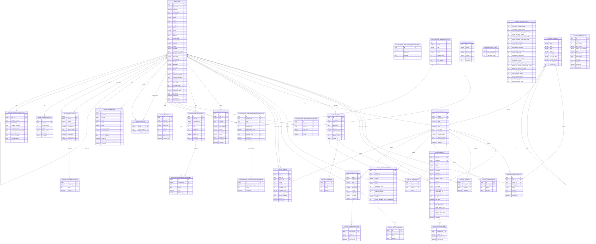

# Database ER Diagram

Generated by `python manage.py generate_db_diagram`.

```mermaid
erDiagram
    %% app: ads
    ADS_ADCAMPAIGN {
        bigint id PK
        bigint store_id FK
        bigint product_id FK
        bigint pack_id FK
        varchar name
        text description
        decimal percentage
        varchar placement
        json display_hours
        varchar audience_mode
        int age_from
        int age_to
        varchar geo_mode
        json target_wilayas
        int target_radius_km
        json target_categories
        bool is_active
        datetime start_date
        datetime end_date
        int max_impressions
        int unique_viewers_count
        int impressions_count
        int delivered_views_count
        int clicks_count
        datetime created_at
    }
    ADS_ADCAMPAIGNVIEWER {
        bigint id PK
        bigint campaign_id FK
        varchar viewer_key
        datetime first_seen_at
        datetime last_seen_at
    }
    %% app: analytics
    ANALYTICS_INTERACTIONLOG {
        bigint id PK
        bigint user_id FK
        bigint product_id FK
        bigint category_id FK
        varchar action
        json metadata
        varchar session_id
        datetime timestamp
    }
    ANALYTICS_USERINTERESTPROFILE {
        bigint id PK
        bigint user_id FK
        json category_scores
        json price_affinity
        float distance_sensitivity
        float quality_sensitivity
        float preferred_max_distance_km
        json preferred_wilayas
        json search_keywords
        json preferred_sellers
        datetime last_updated
    }
    %% app: catalog
    CATALOG_CATEGORY {
        bigint id PK
        varchar name
        varchar name_ar
        varchar name_fr
        varchar name_en
        bigint parent_id FK
        varchar icon_code_point
        varchar icon_font_family
        varchar icon_font_package
        int scarcity_level
    }
    CATALOG_FAVORITE {
        bigint id PK
        bigint user_id FK
        bigint product_id FK
        datetime created_at
    }
    CATALOG_PACK {
        bigint id PK
        bigint merchant_id FK
        varchar name
        text description
        decimal discount
        varchar available_status
        bool delivery_available
        text delivery_wilayas
        datetime created_at
    }
    CATALOG_PACKIMAGE {
        bigint id PK
        bigint pack_id FK
        file image
        bool is_main
    }
    CATALOG_PACKPRODUCT {
        bigint id PK
        bigint pack_id FK
        bigint product_id FK
        int quantity
    }
    CATALOG_PRODUCT {
        bigint id PK
        bigint store_id FK
        bigint category_id FK
        varchar name
        text description
        decimal price
        bool hide_price
        bool negotiable
        varchar available_status
        bool delivery_available
        text delivery_wilayas
        datetime created_at
    }
    CATALOG_PRODUCTIMAGE {
        bigint id PK
        bigint product_id FK
        file image
        bool is_main
    }
    CATALOG_PRODUCTREPORT {
        bigint id PK
        bigint reporter_id FK
        bigint product_id FK
        varchar reason
        text details
        varchar status
        int seriousness_score
        varchar seriousness_level
        json evidence_snapshot
        bool is_low_credibility
        datetime scored_at
        int reporter_reputation_score_at_submission
        datetime created_at
    }
    CATALOG_PROMOTION {
        bigint id PK
        bigint store_id FK
        bigint product_id FK
        varchar name
        text description
        decimal percentage
        bool is_active
        datetime start_date
        datetime end_date
        datetime created_at
    }
    CATALOG_PROMOTIONIMAGE {
        bigint id PK
        bigint promotion_id FK
        file image
        bool is_main
    }
    CATALOG_PROMOTIONVIEWER {
        bigint id PK
        bigint promotion_id FK
        varchar viewer_key
        datetime first_seen_at
        datetime last_seen_at
    }
    CATALOG_REVIEW {
        bigint id PK
        bigint user_id FK
        bigint store_id FK
        bigint product_id FK
        int rating
        text comment
        int credibility_score
        varchar credibility_level
        json evidence_snapshot
        bool is_low_credibility
        datetime scored_at
        datetime created_at
    }
    %% app: feedback
    FEEDBACK_FEEDBACK {
        bigint id PK
        bigint user_id FK
        varchar type
        text message
        file screenshot
        varchar app_version
        varchar platform
        varchar device_info
        varchar status
        text admin_note
        datetime created_at
        datetime updated_at
    }
    %% app: notifications
    NOTIFICATIONS_NOTIFICATION {
        bigint id PK
        bigint actor_id FK
        varchar notification_type
        varchar title
        text body
        int product_id
        int pack_id
        varchar image_url
        json extra_data
        datetime created_at
    }
    NOTIFICATIONS_NOTIFICATIONRECIPIENT {
        bigint id PK
        bigint notification_id FK
        bigint user_id FK
        bool is_read
        datetime read_at
        datetime delivered_at
    }
    %% app: subscriptions
    SUBSCRIPTIONS_MERCHANTSUBSCRIPTION {
        bigint id PK
        bigint store_id FK
        bigint plan_id FK
        datetime start_date
        datetime end_date
        varchar status
    }
    SUBSCRIPTIONS_SUBSCRIPTIONPAYMENTCONFIG {
        bigint id PK
        varchar rib
        text instructions
        bool is_active
        datetime updated_at
    }
    SUBSCRIPTIONS_SUBSCRIPTIONPAYMENTPROOF {
        bigint id PK
        bigint payment_request_id FK
        file image
        datetime created_at
    }
    SUBSCRIPTIONS_SUBSCRIPTIONPAYMENTREQUEST {
        bigint id PK
        bigint merchant_id FK
        bigint plan_id FK
        varchar status
        text payment_note
        varchar status_reason_code
        text status_reason_text
        bigint reviewed_by_id FK
        datetime reviewed_at
        datetime created_at
    }
    SUBSCRIPTIONS_SUBSCRIPTIONPLAN {
        bigint id PK
        varchar name
        varchar slug
        int max_products
        decimal price
        int duration_days
        text benefits
        json plan_features
        bool is_active
    }
    %% app: users
    USERS_ABUSEFLAG {
        bigint id PK
        bigint actor_id FK
        varchar signal_type
        varchar target_type
        int target_id
        int count
        json metadata
        datetime first_seen_at
        datetime last_seen_at
    }
    USERS_FOLLOWER {
        bigint id PK
        bigint user_id FK
        bigint followed_user_id FK
        datetime created_at
    }
    USERS_PHONEOTP {
        bigint id PK
        varchar phone
        varchar code
        datetime created_at
        datetime expires_at
        int attempts
        bool is_verified
    }
    USERS_STOREREPORT {
        bigint id PK
        bigint reporter_id FK
        bigint store_id FK
        varchar reason
        text details
        varchar status
        int seriousness_score
        varchar seriousness_level
        json evidence_snapshot
        bool is_low_credibility
        datetime scored_at
        int reporter_reputation_score_at_submission
        datetime created_at
    }
    USERS_SYSTEMSETTINGS {
        bigint id PK
        int first_login_coins
        int daily_login_coins
    }
    USERS_TRUSTSETTINGS {
        bigint id PK
        int report_quick_submit_seconds
        int review_quick_submit_seconds
        int minimum_interactions_for_high_credibility
        int reporter_reputation_default
        int reporter_reputation_low_quality_penalty
        int reporter_reputation_good_report_bonus
        int report_weight_interactions
        int report_weight_recency
        int report_weight_reputation
        int report_weight_account_age
        int review_weight_dwell
        int review_weight_interactions
        int review_weight_account_age
        int review_weight_history
        int verified_min_credible_positive_reviews
        int verified_max_credible_negative_ratio_percent
        int verified_min_account_age_days
        bool auto_verify_eligible_stores
        int report_cooldown_minutes
        int review_cooldown_minutes
        int max_reports_per_day
        int analytics_retention_days
    }
    USERS_USER {
        bigint id PK
        varchar password
        datetime last_login
        bool is_superuser
        varchar username
        varchar email
        bool is_staff
        bool is_active
        datetime date_joined
        varchar name
        varchar phone
        varchar gender
        date birthday
        file profile_image
        text store_description
        varchar address
        decimal latitude
        decimal longitude
        bool allow_nearby_visibility
        datetime location_updated_at
        varchar store_type
        file cover_image
        varchar facebook
        varchar instagram
        varchar whatsapp
        varchar tiktok
        varchar youtube
        bool show_phone_public
        bool show_social_public
        int coins_balance
        int post_coins
        int ad_view_coins
        datetime last_daily_coin_grant
        varchar verification_status
        bool is_verified
        datetime verified_at
        bigint verified_by_id FK
        text verification_note
    }
    %% app: wallet
    WALLET_COINPACKPLAN {
        bigint id PK
        varchar pack_id
        int coins_amount
        decimal price_amount
        decimal original_price_amount
        varchar title
        varchar promo_badge
        bool is_promoted
        int sort_order
        bool is_active
        datetime created_at
        datetime updated_at
    }
    WALLET_COINPURCHASE {
        bigint id PK
        bigint user_id FK
        varchar pack_id
        int coins_amount
        decimal price_amount
        text payment_note
        varchar status
        datetime approved_at
        bigint approved_by_id FK
        datetime created_at
    }
    WALLET_COINPURCHASEPROOF {
        bigint id PK
        bigint purchase_id FK
        file image
        datetime created_at
    }
    WALLET_COINTRANSACTION {
        bigint id PK
        bigint user_id FK
        int amount_signed
        varchar reason
        varchar related_model
        int related_id
        datetime created_at
    }

    ADS_ADCAMPAIGN ||--o{ ADS_ADCAMPAIGNVIEWER : campaign
    CATALOG_CATEGORY ||--o{ ANALYTICS_INTERACTIONLOG : category
    CATALOG_CATEGORY ||--o{ CATALOG_CATEGORY : parent
    CATALOG_CATEGORY ||--o{ CATALOG_PRODUCT : category
    CATALOG_PACK ||--o{ ADS_ADCAMPAIGN : pack
    CATALOG_PACK ||--o{ CATALOG_PACKIMAGE : pack
    CATALOG_PACK ||--o{ CATALOG_PACKPRODUCT : pack
    CATALOG_PRODUCT ||--o{ ADS_ADCAMPAIGN : product
    CATALOG_PRODUCT ||--o{ ANALYTICS_INTERACTIONLOG : product
    CATALOG_PRODUCT ||--o{ CATALOG_FAVORITE : product
    CATALOG_PRODUCT ||--o{ CATALOG_PACKPRODUCT : product
    CATALOG_PRODUCT ||--o{ CATALOG_PRODUCTIMAGE : product
    CATALOG_PRODUCT ||--o{ CATALOG_PRODUCTREPORT : product
    CATALOG_PRODUCT ||--o{ CATALOG_PROMOTION : product
    CATALOG_PRODUCT ||--o{ CATALOG_REVIEW : product
    CATALOG_PROMOTION ||--o{ CATALOG_PROMOTIONIMAGE : promotion
    CATALOG_PROMOTION ||--o{ CATALOG_PROMOTIONVIEWER : promotion
    NOTIFICATIONS_NOTIFICATION ||--o{ NOTIFICATIONS_NOTIFICATIONRECIPIENT : notification
    SUBSCRIPTIONS_SUBSCRIPTIONPAYMENTREQUEST ||--o{ SUBSCRIPTIONS_SUBSCRIPTIONPAYMENTPROOF : payment_request
    SUBSCRIPTIONS_SUBSCRIPTIONPLAN ||--o{ SUBSCRIPTIONS_MERCHANTSUBSCRIPTION : plan
    SUBSCRIPTIONS_SUBSCRIPTIONPLAN ||--o{ SUBSCRIPTIONS_SUBSCRIPTIONPAYMENTREQUEST : plan
    USERS_USER ||--o{ ADS_ADCAMPAIGN : store
    USERS_USER ||--o{ ANALYTICS_INTERACTIONLOG : user
    USERS_USER ||--o{ CATALOG_FAVORITE : user
    USERS_USER ||--o{ CATALOG_PACK : merchant
    USERS_USER ||--o{ CATALOG_PRODUCT : store
    USERS_USER ||--o{ CATALOG_PRODUCTREPORT : reporter
    USERS_USER ||--o{ CATALOG_PROMOTION : store
    USERS_USER ||--o{ CATALOG_REVIEW : store
    USERS_USER ||--o{ CATALOG_REVIEW : user
    USERS_USER ||--o{ FEEDBACK_FEEDBACK : user
    USERS_USER ||--o{ NOTIFICATIONS_NOTIFICATION : actor
    USERS_USER ||--o{ NOTIFICATIONS_NOTIFICATIONRECIPIENT : user
    USERS_USER ||--o{ SUBSCRIPTIONS_MERCHANTSUBSCRIPTION : store
    USERS_USER ||--o{ SUBSCRIPTIONS_SUBSCRIPTIONPAYMENTREQUEST : merchant
    USERS_USER ||--o{ SUBSCRIPTIONS_SUBSCRIPTIONPAYMENTREQUEST : reviewed_by
    USERS_USER ||--o{ USERS_ABUSEFLAG : actor
    USERS_USER ||--o{ USERS_FOLLOWER : followed_user
    USERS_USER ||--o{ USERS_FOLLOWER : user
    USERS_USER ||--o{ USERS_STOREREPORT : reporter
    USERS_USER ||--o{ USERS_STOREREPORT : store
    USERS_USER ||--o{ USERS_USER : verified_by
    USERS_USER ||--o{ WALLET_COINPURCHASE : approved_by
    USERS_USER ||--o{ WALLET_COINPURCHASE : user
    USERS_USER ||--o{ WALLET_COINTRANSACTION : user
    USERS_USER ||--|| ANALYTICS_USERINTERESTPROFILE : user
    WALLET_COINPURCHASE ||--o{ WALLET_COINPURCHASEPROOF : purchase
```
